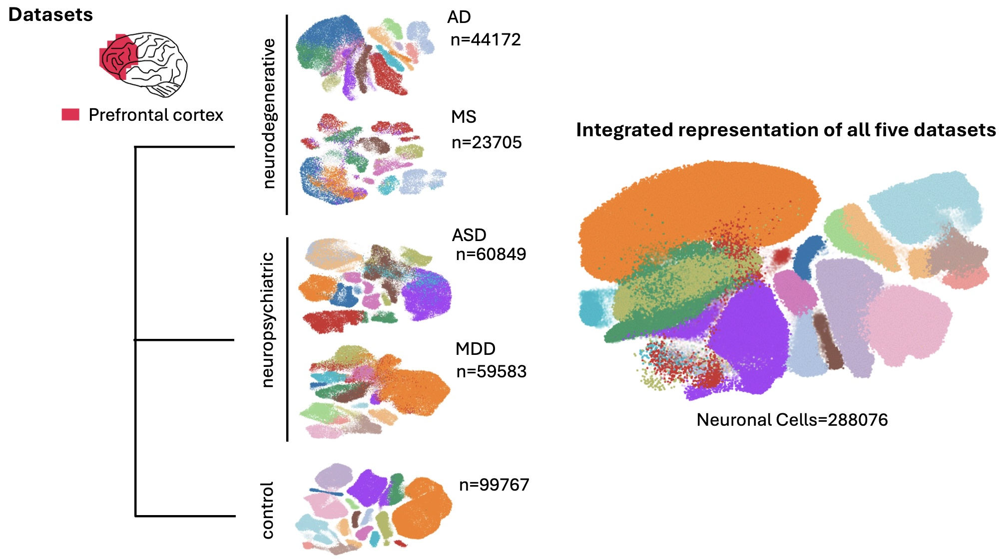
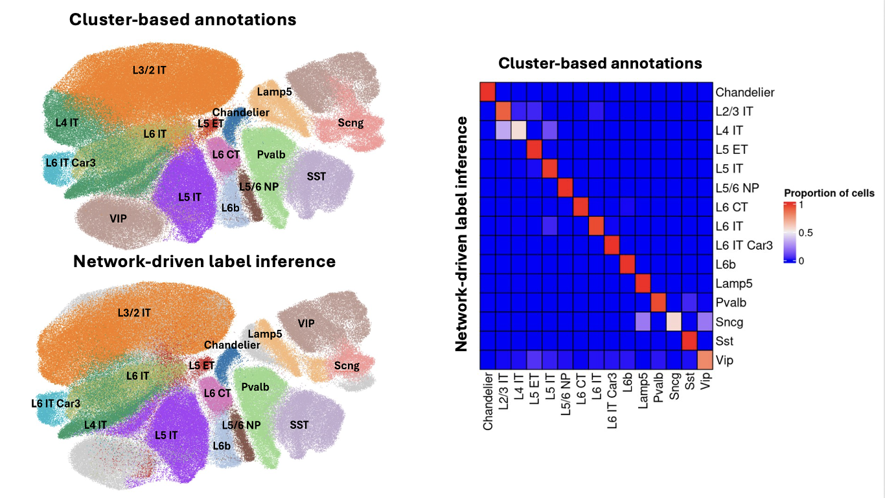
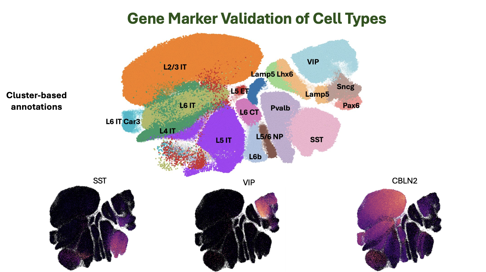
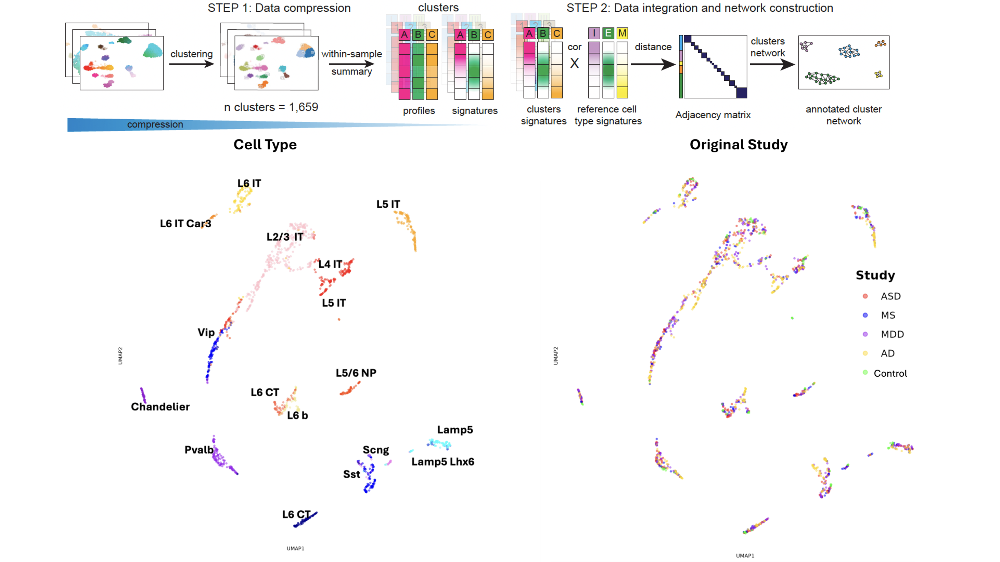
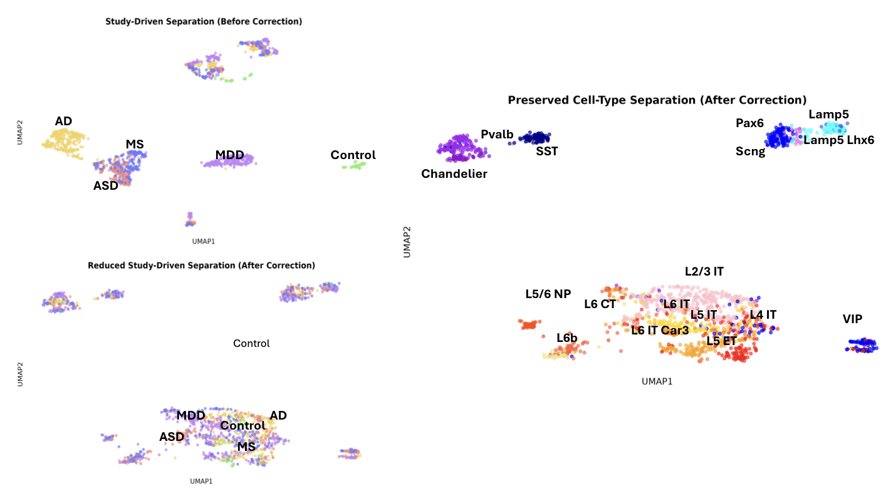

# scRNAseq-cross-disorder-neuronal-integration

We integrated five human prefrontal cortex single-nucleus RNA-seq (snRNA-seq) datasets using two strategies: cell-level and individual-level integration. We performed unified annotation based on clustering and network-driven approaches, and evaluated the integration using assortativity to assess preservation of neuronal structure.

---

## 🧬 Project Overview

This project aims to construct a unified transcriptional landscape across multiple brain disorders, with a specific focus on neuronal populations. By integrating heterogeneous single-nucleus datasets, we explore shared and disorder-specific molecular patterns across conditions.

---

## ⚙️ Methods

- Cell-level integration of snRNA-seq datasets  
- Individual-level integration across samples  
- Cluster-based annotation  
- Network-driven annotation  
- Pseudo-bulk integration  
- Assortativity analysis to evaluate structural preservation  

---

## 📊 Data

- 5 single-nucleus RNA-seq (snRNA-seq) datasets  
- Brain region: Human prefrontal cortex  
- Conditions:
  - Alzheimer’s disease  
  - Multiple sclerosis  
  - Major depressive disorder  
  - Autism  
  - Healthy controls  

---

## 📈 Results

- Single-nucleus integration across datasets  
- Unified neuronal annotation  
- Cluster-level integration consistency  
- Pseudo-bulk integration and reduced assortativity  

---

## 📊 Results Visualization

### Dataset Integration

Integration of five human prefrontal cortex snRNA-seq datasets across neurological and psychiatric disorders.

---

### Neuronal Annotation

Neuronal subtypes were consistently identified across datasets using both cluster-based and network-driven annotation strategies. The heatmap confirms high concordance between methods, supporting the robustness of the annotation.

---
### Marker-based Validation

We validated the annotation by examining canonical excitatory and inhibitory marker genes. The observed consistency between marker expression and assigned neuronal identities supports the robustness of the annotation.

---
### Cluster-level Integration

In this step, the analytical representation is derived from similarity profiles across clusters, enabling a substantial reduction in dimensionality from 288,076 single cells to 1,659 cluster-level representations while preserving meaningful biological structure. By performing clustering at the individual level, batch effects are inherently minimized, and integration is achieved through the alignment of within-individual cluster signatures rather than direct merging of single-cell expression data. Consistently, UMAP visualizations reveal well-preserved neuronal identities and strong mixing across datasets, indicating effective mitigation of batch effects while maintaining biological variation. This framework builds upon a previously published approach (Zonca et al., bioRxiv, 2025), with all analyses and visualizations conducted as part of this study.

---
### Pseudo-bulk Batch Correction Across Studies

We constructed a pseudo-bulk expression dataset from individual-level clusters to enable stable downstream analysis.

Before correction, samples were strongly separated by study, reflecting batch effects introduced by different sequencing platforms and processing pipelines. After batch correction, samples from different studies became well mixed, while neuronal cell-type structure remained clearly preserved.

This indicates that the approach effectively removes technical variation without disrupting biologically meaningful signals.
--- 
## 💻 Code

This repository includes an R Markdown-based workflow for single-nucleus data integration, annotation, and downstream analysis.

---

## 🚀 Key Skills Demonstrated

- Single-nucleus RNA-seq analysis  
- Data integration  
- Transcriptomics  
- Network-based analysis  
- Neurogenomics  
- R / RMarkdown  
