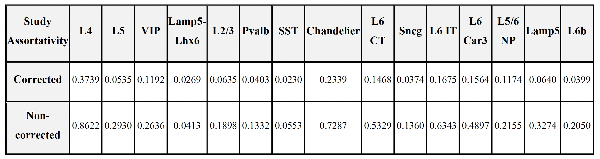

# scRNAseq-cross-disorder-neuronal-integration

The increasing availability of independently generated single-nucleus RNA-seq datasets in neurological and psychiatric disorders provides an opportunity to study transcriptional variation across conditions within a unified framework.

To enable this, we integrated heterogeneous cortical datasets rather than analyzing each disorder in isolation, while addressing key challenges such as annotation inconsistency and study-specific batch effects.

We compared two integration strategies: a conventional cell-level approach and an individual-level, cluster-based strategy that simplifies the representation of the data.

---

## 📊 Data

- 5 single-nucleus RNA-seq (snRNA-seq) datasets  
- Brain region: Human prefrontal cortex  
- Conditions:
  - Alzheimer’s disease  
  - Multiple sclerosis  
  - Major depressive disorder  
  - Autism  
  - Healthy controls  

---

# 📈 Analysis Workflow

## 🔹 Strategy 1: Cell-level Integration

### Dataset Integration

Integration of five snRNA-seq datasets across neurological and psychiatric disorders.

---

### Annotation

Cells were annotated using two complementary approaches: cluster-based annotation and network-driven label inference.  
The high agreement between methods supports the consistency of neuronal identity assignment across datasets.

---

### Marker-based Validation

Annotation was further validated using canonical excitatory and inhibitory marker genes.  
Consistent marker expression patterns confirmed the robustness of the annotation.

---

## 🔹 Strategy 2: Individual-level (Cluster-based) Integration

### Cluster-level Integration

Cluster-level integration was performed using similarity profiles across clusters, reducing dimensionality from 288,076 cells to 1,659 cluster representations while preserving biological structure.

Clustering was performed at the individual level prior to integration, minimizing batch effects and enabling alignment of cluster-level transcriptional signatures rather than direct merging of single-cell data.

---

### Pseudo-bulk Representation

Pseudo-bulk profiles were constructed from individual-level clusters to enable stable downstream analysis.

Batch correction reduced study-driven variation while preserving neuronal cell-type structure, resulting in improved mixing across datasets.

---

### Assortativity Analysis

Integration quality was evaluated using network assortativity with respect to study labels.

Before correction, high assortativity indicated strong study-driven structure. After correction, assortativity decreased substantially (~67%), indicating reduced batch effects.

Connectivity within the network is therefore driven primarily by biological similarity rather than dataset origin.

---

## 💻 Code

This repository includes an R Markdown-based workflow for single-nucleus data integration, annotation, and downstream analysis.

---

## 🚀 Key Skills Demonstrated

- Single-nucleus RNA-seq analysis  
- Data integration  
- Neurogenomics  
- Network-based analysis  
- Batch effect correction  
- R / RMarkdown  
