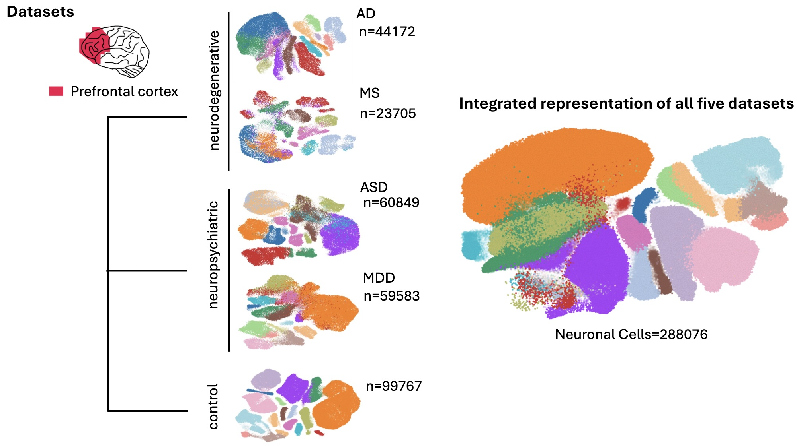
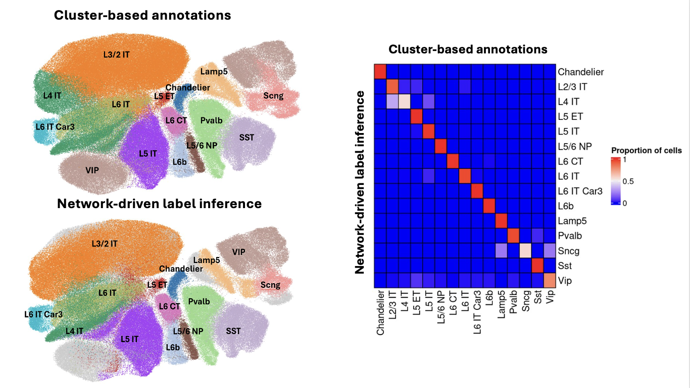
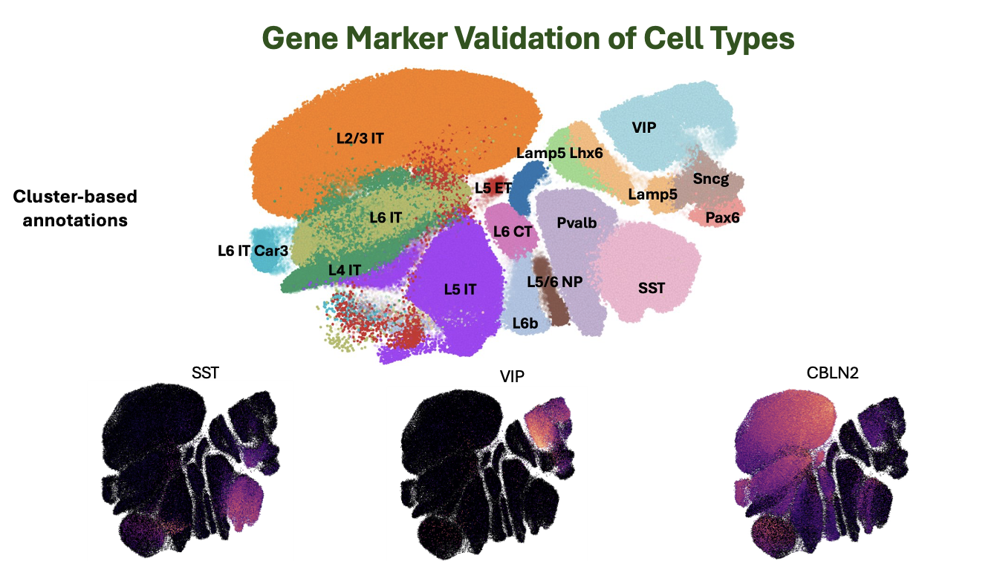
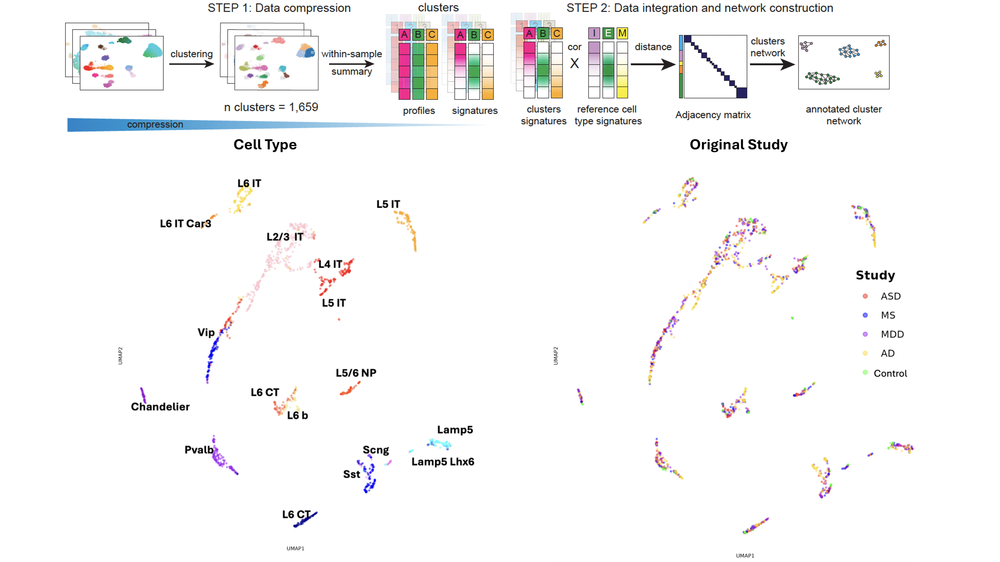
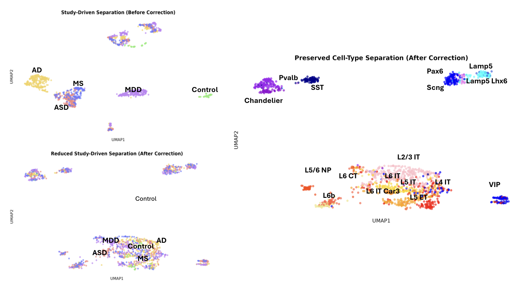
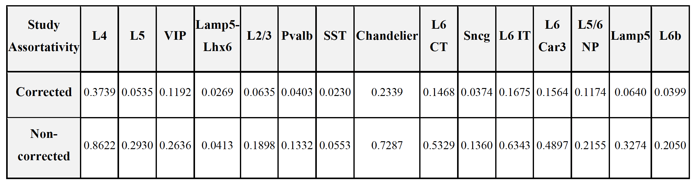

# scRNAseq-cross-disorder-neuronal-integration

With the increasing number of single-nucleus RNA-seq studies in brain disorders, it is now possible to combine datasets from independent studies and compare neuronal changes across conditions.

In this project, we integrated human cortical datasets from AD, MS, MDD, ASD, and healthy controls. The goal was to create a shared analytical framework for studying neuronal transcriptional variation across disorders.

This required addressing three main challenges: sparse and high-dimensional expression data, differences in neuronal cell-type annotations across studies, and study-specific batch effects.

We tested two integration strategies:

1. **Cell-level integration**, where neuronal cells from all datasets were integrated directly.
2. **Individual-level cluster-first integration**, where cells were first clustered within each individual and then integrated across datasets.

---

# 📈 Analysis Workflow

## 🔹 Strategy 1: Cell-level Integration

### Integrated human cortical neuronal dataset



Human cortical single-cell and single-nucleus RNA-seq datasets from five independent studies were integrated, including neurodegenerative and neuropsychiatric disorders.

The ACTIONet representation shows the combined neuronal landscape used for downstream analysis.

---

### Cell-type Annotation



Neuronal identities were assigned using two complementary annotation strategies: cluster-based annotation and network-driven label inference using a reference dataset.

The agreement between the two approaches supports consistent neuronal identity assignment across datasets.

---

### Marker-based Validation



Cell-type annotations were validated using canonical neuronal marker genes associated with excitatory and inhibitory neuronal populations.

The observed marker expression patterns were consistent with the assigned neuronal identities.

---

## 🔹 Strategy 2: Individual-level Cluster-first Integration

### Cluster-level Integration



In this strategy, cells were first clustered within each individual sample before cross-dataset integration.

This reduced the representation from approximately **288,000 cells to 1,659 individual-level clusters**, while preserving biologically meaningful neuronal structure.

The cluster-first integration strategy was adapted from a framework developed in our lab by Zonca et al. (bioRxiv, 2025) and applied here to cross-disorder neuronal integration.

---

### Pseudobulk Representation



Pseudobulk profiles were generated from individual-level neuronal clusters to support more stable downstream comparisons.

After ComBat-seq correction, study-driven separation was reduced while neuronal cell-type structure remained preserved.

---

### Assortativity Analysis



Network assortativity was used to quantify study-driven structure in the integrated representation.

Lower assortativity after correction indicates reduced batch-driven connectivity while preserving biologically meaningful neuronal organization.

---

# 💻 Repository Structure

```text
scripts/
├── 01_data_preparation.Rmd
├── 02_cell_level_analysis.Rmd
├── 03_annotation.Rmd
├── 04_individual_clustering.Rmd
├── 05_foldchange_signatures.Rmd
├── 06_individual_binding_correlations.Rmd
├── 07_individual_neuron_object.Rmd
├── 08_pseudobulk.Rmd
└── 09_assortativity.Rmd

figures/
├── Annotation.png
├── Bulk.png
├── ClusterLevel-Integration.png
├── Dataset-Integration.jpg
├── GeneMarkerValidation.png
└── Assortativity.png
```

---

# ⚙️ Methods Implemented

This repository contains an R/RMarkdown workflow for:

- Multi-dataset snRNA-seq integration
- Cell-level and cluster-level ACTIONet analysis
- Reference-based neuronal cell-type annotation
- Fold-change signature correlation analysis
- Pseudobulk construction
- Batch correction using ComBat-seq
- Network-based integration evaluation using assortativity analysis

---

# 🧰 Main Packages

- ACTIONet
- SingleCellExperiment
- ComplexHeatmap
- sva
- igraph
- umap

---

# ▶️ Running the Pipeline

Scripts are organized sequentially and should be executed in numerical order.

Input datasets are not included in this repository due to size and access restrictions.

Main analyses were performed in R using ACTIONet and SingleCellExperiment workflows.

---

# 🚀 Key Skills Demonstrated

- Single-cell and single-nucleus RNA-seq analysis
- Cross-dataset integration
- Neurogenomics
- Batch effect correction
- Network-based analysis
- Pseudobulk modeling
- R / RMarkdown workflows
